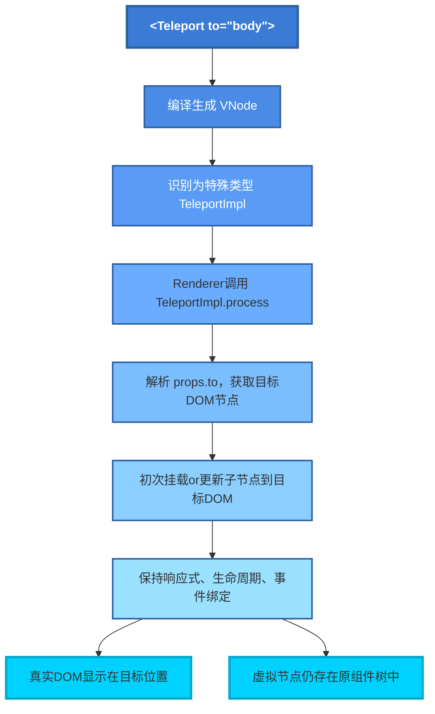

# 响应式数据

根据数据类型【数组和对象】进行不同处理。

1. 对象内部通过`defineReactive`方法，使用`Object.defineProperty()`监听数据属性的`get`进行数据依赖收集，再通过`set`完成数据更新。

2. 数组则通过重写数组方法实现。扩展`7`个变更方法（`push/pop/shift/unshift/splice/reverse/sort`），通过监听这些方法收集依赖和派发更新。

> 多层对象通过递归实现监听，`Vue3`使用`proxy`实现响应式数据。
> 响应式流程：`defineReactive`定义响应式数据；给属性增加`dep`收集对应的`watcher`；等数据变化进行更新。
> `dep.depend`——`get`取值，依赖收集；`dep.notify`——`set`设置，通知视图更新。

<!--more-->

性能优化点：1. 对象层级过深；2. 不需要响应式数据不放在`data`；3. `Object.freeze`可以冻结数据。

# Teleport

> 将组件的渲染内容传送到 DOM 的其他位置，解决布局样式隔离问题。
> 内容渲染在目标 DOM，但逻辑仍属于原组件树（保持响应式、生命周期、事件等）
> Vue3 中将 `Teleport` 作为 `Renderer` 的特殊类型，通过自定义 `process`方法，在`patch`阶段将内容挂载到目标容器，实现逻辑与渲染解耦。
> Vue 会识别特殊标记 `__isTeleport`，将其作为内建组件独立处理。
> 虽然写在原组件树中，但**渲染却发生在 `to` 指定的 DOM 节点**，真正实现逻辑与视图分离。
> Teleport 拥有一整套专属的渲染通道（`render`-->`patch`-->`process`），不会走普通组件流程。

**虚拟节点依旧存在于元祖件树**

**真正挂载的 DOM 被插入到目标容器**

**直接把 DOM 元素渲染到 to 挂载点**

避免样式干扰，提升 UI 解耦性

**更新阶段依旧走 diff 流程**

依旧会触发 `patchChildren`，对比前后 `vnode`，精确更新 DOM。

> 编译时识别 `type` 为 `Teleport`，渲染时走 `TeleportImpl.progress` 逻辑。
> 把 Modal 的 `vnode` 树挂载到 `#modal-root` 容器。
> 后续响应更新时，子树同步更新。
> `Teleport` 组件自身仍然挂载在原地，只是不显示 UI。
> **控制中心**在组件内部
> **投放终端**在目标 DOM 上

# Teleport 渲染流程

